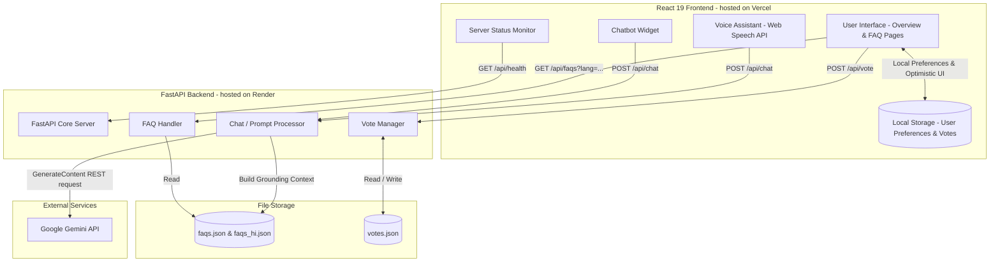

# 🏛️ Technical Project Documentation
## Vicharanashala Internship Portal — IIT Ropar
**An Information Hub and Intelligent Agentic Assistant System**

---

## 1. Executive Summary

The **Vicharanashala Internship Portal** is a production-ready, full-stack web application designed for the **Vicharanashala Lab for Education Design (VLED)** at the **Indian Institute of Technology Ropar (IIT Ropar)**. Under the direction of Prof. Sudarshan Iyengar, the lab conducts online and offline open-source internships focusing on India-centric digital infrastructure in areas like agriculture-tech (**Annam.AI**) and education-tech (**ViBe**).

The portal serves as the official FAQ resource, query resolution hub, and onboarding interface for hundreds of selected interns. To address the administrative overhead of answering repetitive logistical questions (e.g., regarding No Objection Certificates (NOC), start dates, offer letters, evaluation criteria, and stipend eligibility), the portal integrates two key modules:
1. **Interactive FAQ Browser:** A bilingual, searchable, category-filtered, and community-rated knowledge base.
2. **Yaksha AI Agent:** An intelligent conversational assistant powered by Google Gemini 2.5 models that is strictly grounded in the lab's rules and policies, providing both written chat and conversational voice interfaces.

---

## 2. System Architecture

The project utilizes a decoupled **Client-Server architecture** with state management and external AI model integration.



### Architectural Details
* **Frontend (Client Layer):** Single Page Application (SPA) built using React 19 and Vite. The frontend manages local persistent states (e.g., language selection, dark/light theme, and historical voting records) in `localStorage` to maximize performance.
* **Backend (API Layer):** Lightweight Python FastAPI application running asynchronously via Uvicorn. It processes REST API endpoints, acts as an intermediary gateway to Google's Gemini models (preventing client-side API key exposure), and implements a custom CORS middleware validation system.
* **Database Layer:** Simplified flat JSON database structures are used for persistence, allowing fast start-up, easy versioning, and minimum runtime latency for static-style resources.

---

## 3. Core Features & Capabilities

### 🔍 Searchable, Bilingual FAQ Engine
* **Instant Filtering:** Real-time client-side substring matching sweeps across both questions and answers to filter results instantly as the user types.
* **Multi-Language Support:** Instant toggle between English and Hindi (`lang=en` and `lang=hi`) with full page state preservation.
* **Navigation Synchronizer:** Highlights active categories dynamically using an `IntersectionObserver` on desktop (via a sticky sidebar) and on mobile (via scrollable top chips).

### 🤖 Yaksha AI Chatbot Widget
* **Gemini Grounding:** Yaksha reads the entire FAQ database at system startup, injecting it directly into its core system prompt.
* **Context-Aware Dialogue:** Stores and passes multi-turn conversation histories back to the server to handle conversational follow-ups.
* **Suggestive Chips:** Exposes quick-click questions to help guide the user's initial onboarding query.
* **Rate-Limit Safe:** Enforces a client-side 5-second request cooldown timer to remain safely within Gemini free-tier quotas (15 requests per minute).

### 🎙️ Conversational Voice Assistant
* **Web Speech Integration:** Implements browser-native Speech Recognition (`SpeechRecognition` / `webkitSpeechRecognition`) to convert spoken queries directly into text.
* **Text-to-Speech (TTS) Feedback:** Converts AI text responses back into audible speech using the Speech Synthesis API (`SpeechSynthesisUtterance`), specifically attempting to locate Indian-accented English (`en-IN`) voices for localized clarity.
* **Conversational Loop:** Orchestrates microphone states automatically. The assistant mutes during network processing and AI speech synthesis, and resumes listening immediately once the audio ends.

### 👍 Helpful/Not Helpful Feedback System
* **Optimistic UI Updates:** Reflects voting actions immediately in UI counters, and persists choices in `localStorage` to prevent multiple votes by the same user.
* **Dynamic Delta Math:** Automatically handles vote swaps (e.g., changing from upvote to downvote decrements the old tally and increments the new one).

### 📊 Real-Time Server Health Tracker
* **Passive Health Checks:** Polls the backend `/api/health` endpoint every 5 seconds.
* **Visual Status Indicators:** Employs animations (spinning indicator during health check) and dynamic SVG symbols (WiFi icon for online, slashed WiFi icon for offline).

---

## 4. Technical Implementation: Frontend (React 19)

### 4.1 Root App Setup and Dark Mode
Theme management uses pure CSS variables defined in [index.css](file:///d:/Projects/IIT-Ropar/frontend/src/index.css), injected dynamically at the document root level.

```jsx
// App.jsx
const THEME_KEY = 'vicharanashala_theme';

const [theme, setTheme] = useState(() => {
  return localStorage.getItem(THEME_KEY) || 'dark';
});

useEffect(() => {
  document.documentElement.setAttribute('data-theme', theme);
  localStorage.setItem(THEME_KEY, theme);
}, [theme]);
```

### 4.2 Dynamic Scroll Synchronization
To keep the left categories sidebar highlighted as the user scrolls, [FAQPage.jsx](file:///d:/Projects/IIT-Ropar/frontend/src/pages/FAQPage.jsx) sets up an `IntersectionObserver` pointing to category sections.

```javascript
useEffect(() => {
  if (faqs.length === 0) return;

  const observerOptions = {
    root: null,
    rootMargin: '-110px 0px -65% 0px', // Active zone: top-middle of the screen
    threshold: 0,
  };

  const observerCallback = (entries) => {
    entries.forEach((entry) => {
      if (entry.isIntersecting) {
        const secId = entry.target.id.replace('sec-', '');
        setActiveSection(secId);
      }
    });
  };

  const observer = new IntersectionObserver(observerCallback, observerOptions);
  const targets = document.querySelectorAll('.faq-category');
  targets.forEach((target) => observer.observe(target));

  return () => {
    targets.forEach((target) => observer.unobserve(target));
  };
}, [faqs, searchQuery]);
```

### 4.3 Voice Assistant State Machine
The voice module coordinates microphone inputs, network transitions, and speech synthesizers via a central status state: `'idle' | 'listening' | 'thinking' | 'speaking' | 'error'`.

```javascript
// VoiceAssistant.jsx: Listening loop execution
const startSpeechRecognition = () => {
  const SpeechRecognition = window.SpeechRecognition || window.webkitSpeechRecognition;
  if (!SpeechRecognition) {
    setStatus('error');
    return;
  }
  
  stopSpeechRecognition();
  silenceSpeechSynthesis();

  const recognition = new SpeechRecognition();
  recognitionRef.current = recognition;
  recognition.continuous = false; // Turn-taking approach
  recognition.interimResults = true;
  recognition.lang = 'en-IN'; // Set to Indian English Accent

  recognition.onstart = () => {
    setStatus('listening');
  };

  recognition.onresult = (event) => {
    let final = '';
    for (let i = event.resultIndex; i < event.results.length; ++i) {
      if (event.results[i].isFinal) {
        final += event.results[i][0].transcript;
      }
    }
    if (final.trim()) {
      handleFinalInput(final.trim());
    }
  };

  recognition.start();
};
```

---

## 5. Technical Implementation: Backend (FastAPI)

The backend code in [main.py](file:///d:/Projects/IIT-Ropar/backend/main.py) leverages FastAPI's fast response serialization and automatic Pydantic request body validations.

### 5.1 CORS Configuration & Origin Regex
To secure endpoints against external domains while allowing development environments and Vercel production hosting, CORS middleware is dynamic:

```python
# main.py
app.add_middleware(
    CORSMiddleware,
    allow_origin_regex=r"https://[\w\-]+(\.vercel\.app)$", # Allowing any Vercel subdomain
    allow_origins=[
        "http://localhost:5173",
        "http://localhost:3000",
        "http://localhost:4173",   # Vite preview port
    ],
    allow_credentials=True,
    allow_methods=["*"],
    allow_headers=["*"],
)
```

### 5.2 API Data Validation Models
FastAPI uses Pydantic schemas to validate Incoming JSON structures:

```python
from pydantic import BaseModel
from typing import Optional, List

class VoteRequest(BaseModel):
    faq_id: str
    vote_type: Optional[str] = None  # "up", "down", or None (representing removal)
    previous_vote: Optional[str] = None

class ChatMessage(BaseModel):
    role: str   # "user" or "model"
    text: str

class ChatRequest(BaseModel):
    query: str
    history: Optional[List[ChatMessage]] = []
```

### 5.3 Asynchronous API Endpoints
* **Health Check (`GET /api/health`):** Tracks application start times to calculate total uptime.
* **Fetch FAQs (`GET /api/faqs`):** Takes a `lang` parameter to load and serve language-specific files.
* **Submit Vote (`POST /api/vote`):** Thread-safe read/write operations on the JSON database file structure.

---

## 6. Yaksha AI Engine & Grounding Logic

### 6.1 Context Extraction (Retrieval-Augmented Generation)
At startup, the backend flattens the structured JSON FAQ schema into simple text representation. It strips HTML tags (such as `<p>` and `<ul>`) using regular expressions and stores the result in memory as `FAQ_KNOWLEDGE_BASE`.

```python
def load_faq_text() -> str:
    with open(FAQS_PATH, "r", encoding="utf-8") as f:
        sections = json.load(f)
    lines: List[str] = []
    for section in sections:
        lines.append(f"\n## {section['title']}\n")
        for q in section["questions"]:
            clean_answer = re.sub(r"<[^>]+>", " ", q["answer"])
            clean_answer = re.sub(r"\s+", " ", clean_answer).strip()
            lines.append(f"Q: {q['question']}")
            lines.append(f"A: {clean_answer}\n")
    return "\n".join(lines)
```

This knowledge base is then injected into the model's core configuration system prompt (`YAKSHA_SYSTEM_PROMPT`).

### 6.2 System Directives
The prompt instructs the AI to enforce specific constraints:
1. **Narrow Scope:** Answer questions ONLY concerning Vicharanashala, samagama.in, ViBe LMS, NOCs, offer letters, Rosetta journal, and program deadlines.
2. **Polite Redirection:** Politely redirect unrelated queries to the program email (`sudarshansudarshan@gmail.com`).
3. **No Hallucinations:** Strictly ground answers in the FAQ knowledge base. Do not invent information.
4. **Format Limitation:** Generate plain, readable text only. Avoid markdown syntax (`**`, `##`, list dashes) because the front-end chat widget displays plain text directly.

### 6.3 Dual-Model Fallback Strategy
To maintain service availability if the free API quota for `gemini-2.5-flash` is exhausted, the server automatically catches HTTP `429` errors and falls back to `gemini-2.5-flash-lite`:

```python
# REST-based endpoint invocation with automatic fallback
YAKSHA_MODEL    = "gemini-2.5-flash"
YAKSHA_FALLBACK = "gemini-2.5-flash-lite"

models_to_try = [YAKSHA_MODEL, YAKSHA_FALLBACK]

for model in models_to_try:
    try:
        url = f"https://generativelanguage.googleapis.com/v1beta/models/{model}:generateContent?key={GEMINI_API_KEY}"
        resp = http_requests.post(url, json=payload, timeout=30)
        
        if resp.status_code == 429: # Quota limit hit
            print(f"[Yaksha] {model} quota exhausted, trying fallback...")
            continue

        if not resp.ok:
            detail = resp.json().get("error", {}).get("message", resp.text)
            raise HTTPException(status_code=500, detail=f"Yaksha error: {detail}")

        answer = resp.json()["candidates"][0]["content"]["parts"][0]["text"]
        return {"answer": answer.strip()}
    except HTTPException:
        raise
    ...
```

---

## 7. Schema & File-based Persistence

The database relies on three main files inside the `backend/` directory:

### 7.1 FAQ Scheme (`faqs.json` / `faqs_hi.json`)
Consists of category segments containing lists of individual FAQ objects:

```json
[
  {
    "id": "s-1",
    "title": "1. About the internship",
    "questions": [
      {
        "id": "q-1-1",
        "section_id": 1,
        "question": "1.1 What is the Vicharanashala internship?",
        "answer": "<p>A two-month, full-time engagement at the Vicharanashala Lab, a research lab at IIT Ropar. You will work on a real open-source project...</p>"
      }
    ]
  }
]
```

### 7.2 Votes Database Schema (`votes.json`)
A simple mapping linking unique question IDs to upvote and downvote counts:

```json
{
  "q-1-1": {
    "up": 24,
    "down": 2
  },
  "q-2-1": {
    "up": 18,
    "down": 0
  }
}
```

---

## 8. Deployment & Environment Configurations

### 8.1 Production Setup
* **Frontend Hosting:** Deployed to **Vercel** for CDN caching of static build bundles.
* **Backend Hosting:** Deployed to **Render** using a persistent storage disk to prevent resetting `votes.json` on server restarts.
* **AI API Access:** Integrated with **Google AI Studio** keys.

### 8.2 Production Environment Variables
#### Frontend (.env.production)
```env
VITE_API_BASE=https://vicharanashala-internship.onrender.com/api
```
#### Backend (.env)
```env
GEMINI_API_KEY=AIzaSy...your_gemini_key_here
```

---

## 9. Conclusion & Project Accomplishments

The Vicharanashala Internship Portal successfully transitions traditional static FAQs into an interactive, bilingual, and agent-driven platform. 

### Key Technical Achievements:
* **True Grounding:** By injecting the structural database directly into the LLM system instructions, the chatbot answers administrative queries with 100% factual alignment, resolving the issue of LLM hallucination in policy guidelines.
* **Conversational Voice Mode:** Combining speech recognition and text-to-speech synthesis directly with a REST-grounded AI agent creates a hands-free conversational interface that runs entirely in standard browsers without third-party audio integrations.
* **Resilient Architecture:** The client-side caching of local user votes and the server-side dual-model fallback system ensure high availability under heavy user traffic, even when operating under strict API rate limits.
